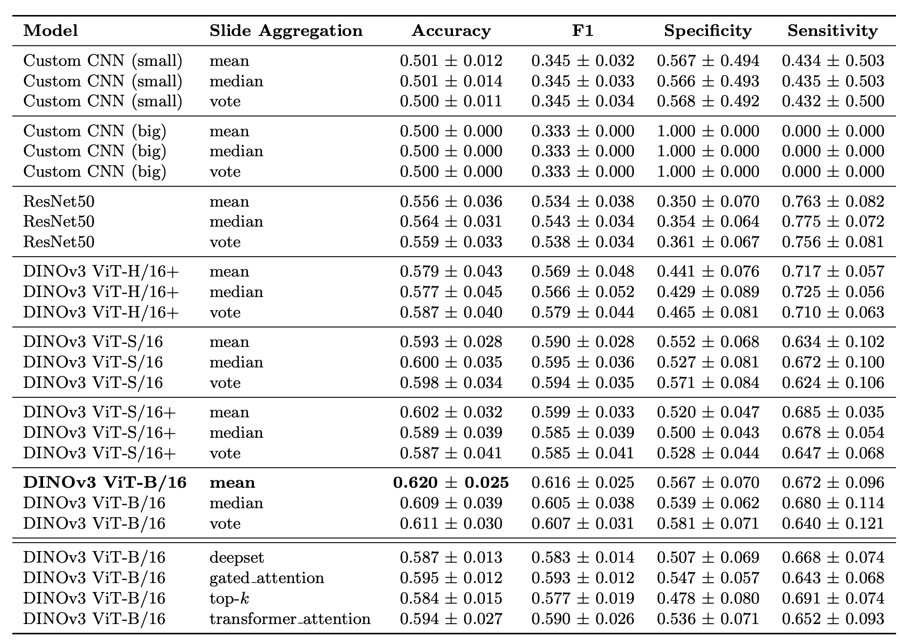

# SMMALA 🦠 Detection of Malaria Infection from Parasite-Free Blood Smears

## Introduction

This project is a collaboration between the [IRD](https://www.ird.fr) and [ENS Ulm](https://www.ens.psl.eu).

---

## Setup Instructions

### 1️⃣ Clone the repository (with submodules)

The project depends on the [`dinov3`](https://github.com/facebookresearch/dinov3) submodule. To ensure reproducibility, clone the repository **with submodules**:

```bash
git clone --recurse-submodules https://github.com/Saranga7/SMMALA.git
```

If the user already cloned without submodules, initialize them with:

```bash
git submodule update --init --recursive
```

### 2️⃣ Download dinov3 weights
After cloning, download the pretrained dinov3 weights and place them in `weights/pretrained`. Depending on which dinov3 encoder backbones the user wants to experiment with, it should look somthing like this:

```
weights/pretrained
├── dinov3_vit7b16.pth
├── dinov3_vitb16.pth
├── dinov3_vith16plus.pth
├── dinov3_vitl16.pth
├── dinov3_vits16plus.pth
└── dinov3_vits16.pthn
```

### 2️⃣ Download data

Download the images from [here](https://huggingface.co/datasets/nicoboou/smmala/tree/main). Preferably store the images at `preprocessed_data/dataset`, otherwise mandatorily set data.dataset_path in the config.

### 3️⃣ Setup virtual environment

Make sure the user has [uv](https://docs.astral.sh/uv/) installed.

```bash
uv venv
uv sync
```

## Model training/testing

### 1️⃣ Generate embeddings

The user can train with two different modes: 
1. Using images as inputs
2. Using precomputed embeddings from a frozen encoder (to be used when backbone doesn't need fine-tuning). This is much faster and light on computation as only the classification head is mounted in the GPU

The latter requires this step. 

⚠️ **Note:** This step is only required if you want to train using **precomputed embeddings**.  If you are training with images as inputs, skip this step.


Adjust the config file: `configs/get_image_embeddings.yaml`. 

#### Essential Fields to Edit

| Field | Description | Notes / Possible Values |
|-------|-------------|------------------------|
| `augmentations.enable_augmentation` | Enable or disable augmentations | `True` or `False`. Recommended to try both modes per model. Not required but strongly recommended for training. |
| `augmentations.num_augmentations` | Number of augmentations per image | Example: `10` → generates 10 embeddings per image from different augmentations |
| `model.name` | Choice of encoder model | If using DinoV3 models, ensure weights are in `weights/pretrained` |
| `data.img_dir` | Path to the images | Required |
| `data.test_set_img_dir` | Path to test images | Usually same as `data.img_dir` unless using different images (e.g., crops) |


After the config is modified according to the user's needs,
```bash
cd get_embeddings
bash run_get_image_embeddings.sh
cd ..
```

### 3️⃣ Train and Test


Edit the configuration file: `configs/emb_subVneg.yaml` (or `configs/img_subVneg.yaml`).

#### Essential fields:

| Field | Description | Notes / Possible Values |
|-------|-------------|------------------------|
| `wandb.entity` | Wandb username of the user | Required for logging |
| `data.fold_index` | Which fold to use | `[0, 1, 2, 3]` |
| `data.dataset_path` | Path to the images | Default: `preprocessed/dataset` |
| `data.aug_embeddings_path` | Path to augmented embeddings | Required only if using augmented embeddings during training |
| `data.embeddings_path` | Path to embeddings | Required when using embeddings as input (both training & testing) |
| `data.data_collection_method` | Level of data aggregation | `slide` or `image` |
| `model.use_imgs_or_embeddings` | Mode of input | `images` or `embeddings` |
| `model.name` | Backbone encoder model | If using DinoV3, ensure weights exist in `weights/pretrained` |
| `model.use_complex_head` | Complexity of classification head | `1`, `1.5`, `2`, `3` |
| `model.slide_aggregator_method` | Aggregation method for slide-level | e.g., `mean`, `max`, `topk`, `deepset`, etc. |
| `training.enabled` | Whether to enable training | `true` or `false` |
| `testing.weights_filename` | Weights filename for testing | Not required if `training.enabled=true` |


| Aggregation Level       | Available Methods                                           |
|-------------------------|------------------------------------------------------------|
| **Image-level Training** | `vote`, `median`, `mean`                                   |
| **Slide-level Training** | `mean`, `max`, `topk`, `deepset`, `gated_attention`, `transformer_attention` |


After the config is modified according to the user's needs,

```bash
python train.py --config-path="configs/train" --config-name="emb_subVneg.yaml" 
```

#### Example Script

A script that uses `dinov3_vitb16` with a `mean` aggregation strategy and loops over 4 folds (4 seeds per fold) by overriding the values in the config:

```bash
bash run_training.sh
```

After training, model weights are by default saved in `weights/custom`


## Results

<p align="center">
  
  <br>
  <em>Performance metrics for models using simple (top) and complex (bottom) slide-level aggregation. Reported accuracy corresponds to the overall mean across 4 stratified folds of the per-fold mean accuracy over 4 runs with distinct random seeds. Values are presented as mean ± std. Data collection was image-based. Embeddings were used as inputs (except for the Custon CNN models).
</em>
</p>

